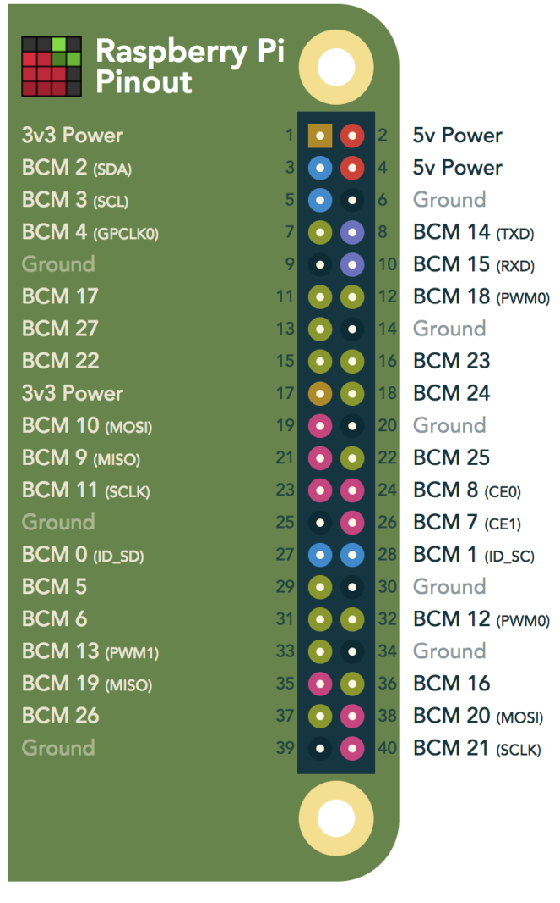

## Pinout


[](https://pinout.xyz/)

## I2C


* Run `sudo raspi-config` to enable i2c.  
* `ls /dev/*i2c*` should give `/dev/i2c-1`
* `sudo apt-get install -y i2c-tools` - install command-line utility programs.  
* `i2cdetect -y` - list all devices on the bus


``` sh
pi@raspberrypi:~/$ i2cdetect -y 1
     0  1  2  3  4  5  6  7  8  9  a  b  c  d  e  f
00:          -- -- -- -- -- -- -- -- -- -- -- -- --
10: -- -- -- -- -- -- -- -- -- -- -- -- -- -- -- --
20: -- -- -- -- -- -- -- -- -- -- -- -- -- -- -- --
30: -- -- -- -- -- -- -- -- -- -- -- -- -- -- -- --
40: -- -- -- -- -- -- -- -- -- -- -- -- -- -- -- --
50: -- -- -- -- -- -- -- -- -- -- -- -- -- -- -- --
60: 60 -- -- -- -- -- -- -- -- -- -- -- -- -- -- --
70: -- -- -- -- -- -- -- --
```

## 1 Wire 
[Mainly copied from https://pinout.xyz/pinout/1_wire](https://pinout.xyz/pinout/1_wire)

To enable the one-wire interface add the following line to `/boot/config.txt`  
`dtoverlay=w1-gpio`

or

`dtoverlay=w1-gpio,gpiopin=x` to use a custom pin (default is BCM4).

Alternatively the one-wire interface can be enable on demand using raspi-config, or the following:

`sudo modprobe w1-gpio`
Newer kernels (4.9.28 and later) allow you to use dynamic overlay loading instead, including creating multiple 1-Wire busses to be used at the same time:

```
sudo dtoverlay w1-gpio gpiopin=4 pullup=0  # header pin 7
sudo dtoverlay w1-gpio gpiopin=17 pullup=0 # header pin 11
sudo dtoverlay w1-gpio gpiopin=27 pullup=0 # header pin 13
```
once any of the steps above have been performed, and discovery is complete you can list the devices that your Raspberry Pi has discovered via all 1-Wire busses (by default BCM4), like so:

`ls /sys/bus/w1/devices/`
n.b. Using w1-gpio on the Raspberry Pi typically needs a 4.7 k? pull-up resistor connected between the GPIO pin and a 3.3v supply.

