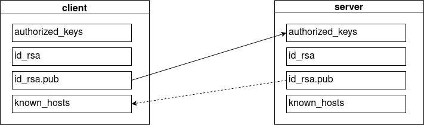

## ssh

### Configure ssh keys

* https://kb.iu.edu/d/aews
* https://www.cyberciti.biz/faq/how-to-set-up-ssh-keys-on-linux-unix/
* https://nerderati.com/2011/03/17/simplify-your-life-with-an-ssh-config-file/
	
### Understand key management

[](https://www.ssh.com/academy/ssh/key)

*** Generating and sharing keys ***  
The client generate its own key pair.  
- Its private key shal remain private, not comprimized, not duplicated elswhere. it should be secured with a passphrase to guarantee that only the owner can use it.  
- The client copies its public key on the server (using the tool ssh-copy-id). When the key is copied, the server trusts the client. It will then consider the client key an "authorized_key".  


*** Remote login ***    
The client execute ssh to server hostname using a specific username (the one associated with the key).  
The server uses the public key to encrypt a message that the client will decrypt with its private key. The client send back this message to the server. the server knows the client realy owns its private key (the identity of the client is confirmed).  

During the first login, the client stored the server's pub_key to remember this server.  

*** Key management ***    
A client machine (a personal computer) has typically:
- One private / public key pair (stored in id_rsa, id_rsa.pub)
- Every server known bu the client has its public key stored in "know_hosts"

A server machine has typically:
- One private / public key pair (stored in id_rsa, id_rsa.pub)
- A list of public keys, each one belongs to a client autorized to acces the server, stored in "authorized_keys" 

## webmin

installation (ubuntu 18)

``` bash
sudo sh -c 'echo "deb http://download.webmin.com/download/repository sarge contrib" > /etc/apt/sources.list.d/webmin.list'
wget -qO - http://www.webmin.com/jcameron-key.asc | sudo apt-key add -
sudo apt-get update
sudo apt-get install webmin
sudo ufw allow 10000/tcp
```
[https://localhost:10000](https://localhost:10000)

## serveur monitoring
	
	nmon
	glances

## x11vnc 

### Configurations

côté server:
installer x11vnc
    
    apt install x11vnc

configurer server ssh

    X11Forwarding yes

option X11 config (pour autoriser lancer startx depuis ssh)
    
    nano /etc/X11/Xwrapper.config
    allowed_users = anybody


### Avec session graphique ouverte sur le server

côté server
Démarrer une sessiosn graphique avec xorg
lancer x11vnc sur le server (éventuellement via ssh depuis le client)

    x11vnc
    
côté client
avec remmina (ou autre client vnc) lancer session vnc avec l'ip du server (eventuellement préciser port si différent de 5900)


### Sans session graphique ouverte sur le server

problème: VNC duplique un bureau (le bureau d'un utilisateur déja loggé dans une session graphique).
il faudrait pouvoir lancer une session graphique à distance (startx) mais ne fonctionne pas si pas root.
solution:

configurer l'utilisateur en autologin after reboot
redémarrer le server (la session graphique se lance)

lancer x11vnc sur le server (via ssh depuis le client)

    x11vnc
    
côté client
vnc://server_ip:5900

### lancer une seule application (sans session server)

    ssh -X <username>@<host> gedit &

-X      Enables X11 forwarding.
        This can also be specified on a per-host basis in a configuration file.

        X11 forwarding should be enabled with caution.  Users with the
        ability to bypass file permissions on the remote host (for the
        user's X authorization database) can access the local X11
        display through the forwarded connection. An attacker may then
        be able to perform activities such as keystroke monitoring.

Check /etc/ssh/sshd_config on the server side:

    sudo nano /etc/ssh/sshd_config

for the lines below:

    X11Forwarding yes
    X11UseLocalhost no

Restart the ssh srever, if you have made changes:

    sudo service ssh restart

Check /etc/ssh/ssh_config on the client side:

    sudo nano /etc/ssh/ssh_config

for the lines below

    ForwardX11 yes
    ForwardX11Trusted yes

 
